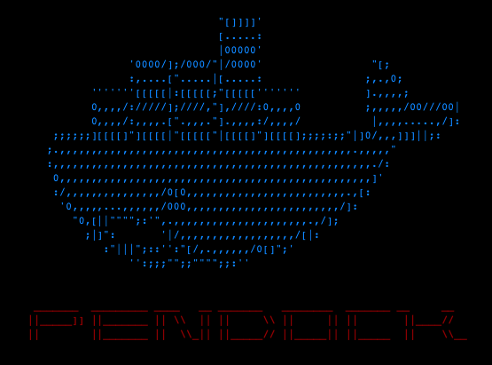
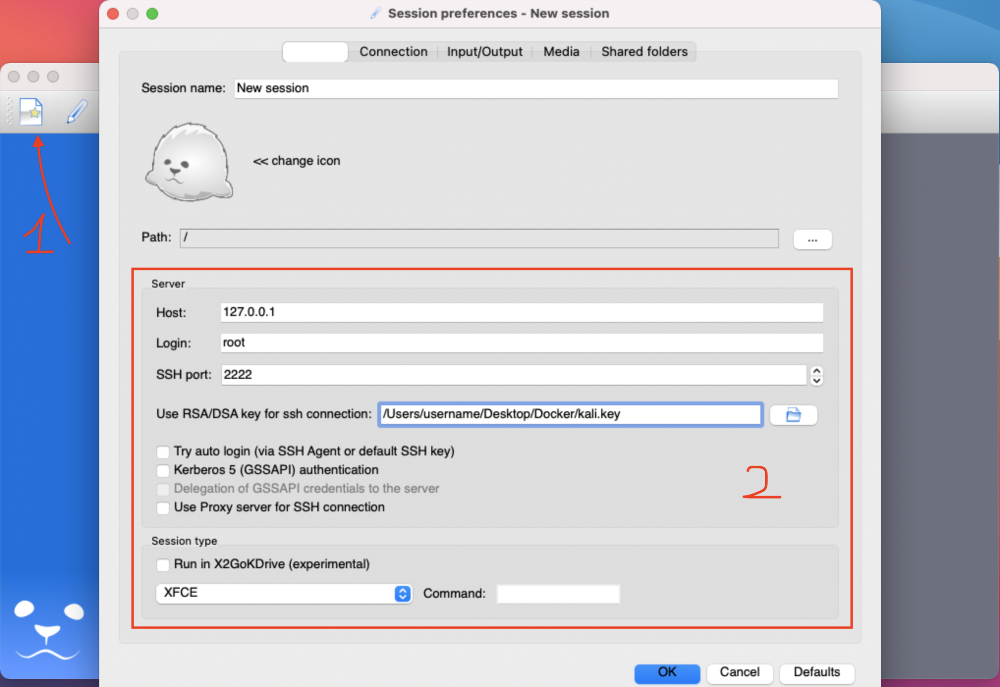
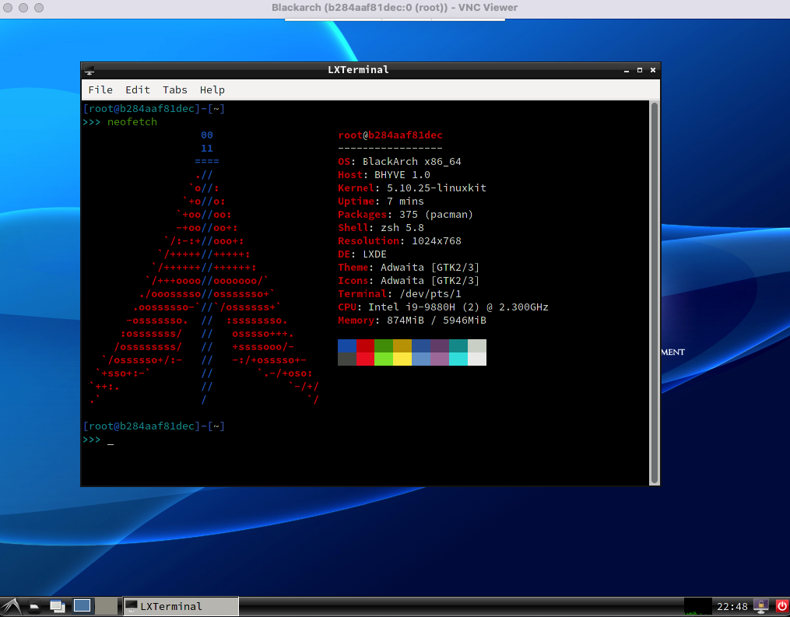
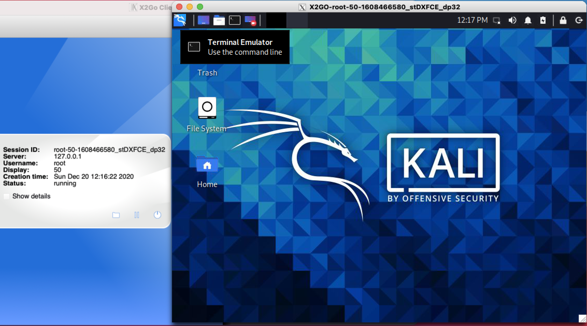

# A Penetration Testing Docker Container (PenDock)



PenDock is a script to deploy penetration testing docker container that is either based on Blackarch or Kali Linux. Desktop access is provided as well over X2Go or VNC.

[](https://opensource.org/licenses/MIT)
[](https://github.com/Kr0ff/PenDock/issues)

[](https://twitter.com/CptXrat)
[](https://github.com/Kr0ff)

## 0x01 - Update (30/12/2021):

The script can now build a Blackarch or a Kali Linux container. The main difference is how desktop/GUI access is established. 

For Kali Linux, GUI access is provided via X2Go which uses just SSH connection to create the GUI access.

For Blackarch, access is provided via VNC. This was done due to some complications with systemd so VNC was a great alternative. Additionally, since connection is done on localhost, there should be no lag.

The script will use the "*Dockerfile.[kali/barch].mod*
" file respectively as a template to create a new "*Dockerfile*" and append the necessary details to it such as which Kali metapackage to install and deploy SSH key.

- <span style="color: yellow">WARNING</span>: The script uses <span style="color: red">sudo</span> to run docker commands due to default linux installation not including the low-privileged user in the docker group.

This, however, does not apply to MacOS so feel free to edit the script and remove the <span style="color: red">sudo</span> command.

Currently for the Kali container, the script will use 4 of the main metapackages in its repository:

- kali-linux-core (Takes up to ~2.2GB)
- kali-linux-default (Takes up to ~8.5GB)
- kali-linux-large (Takes up to ~12GB)
- kali-linux-everything (Takes up to ~19.5GB)

For the Blackarch container, there is only 1 option. This is due to the sizes of the repository tools groups being too large.

- blackarch-core (Takes up to ~1.67GB)

If you would like to make it so you have only individual packages that you need, you can simply edit the "*Dockerfile.[kali/barch].mod* files.
There are 2 bits you need to change if you're editing the script, the `SSH_PUBKEY` and `META_PACKAGE`. Simply replace with your changes and you're ready to build the image.

*NEW* Support added for Parrotsec linux. Please note that I do _**not**_ recommend using it at this point. I have experienced issues with creating the container due to APT not able to retrieve some dependency packages. APT would return a **404 Not Found** for random packages and this breaks the creation of the docker container. 

Therefore, I have only done limited testing !

This, of course, maybe per individual issue and you might not be affected. You might have to run the script multiple times or just run 

```bash
docker build -t <CONTAINER_NAME> ./parrotsec/.
```
and this will build your container. Bear in mind that the `Dockerfile` file will be created once the script hits the point of package selection. Alternatively, you can just create your own one.

### 0x011 Windows PowerShell Support:

As of version 0.5, a PowerShell script exists to allow Windows users to deploy containers easily !

To run it, open PowerShell 

```powershell
PS > .\build.ps1
```

or CMD window

```cmd
C:\ > powershell
PS > .\build.ps1
```

## 0x02 - How to build:

```bash
git clone https://github.com/Kr0ff/PenDock
cd PenDock && chmod +x build.sh
./build.sh
```

Then follow the on-screen instruction and you should be good to go. 

After successful deployment of the container you can check if the container has port 2222 (Kali Linux) or 2223 (Blackarch) on localhost directed to 22 on the container. 

Type in terminal:
```bash
docker container ls -a
```

Example output:

```bash
CONTAINER ID   IMAGE       COMMAND               CREATED        STATUS         PORTS                    NAMES
5f89dcd8b5b5   kalilinux   "/usr/sbin/sshd -D"   47 hours ago   Up 2 seconds   127.0.0.1:2222->22/tcp   kalilinux
```

## 0x03 - Connect and use desktop environment

### 0x031 - Kali Linux

GUI connection to the Kali Linux container is done very simply.

After installing X2Go on your host, open it and click on the button to create a new connection.



To find out more: https://wiki.x2go.org/doku.php/doc:installation:x2goclient

In the new window, set up the field parameters, `Host` should be set as `127.0.0.1`(✅) instead of ~~`localhost`~~(❌). For some reason X2Go can't understand localhost as its domain alternative.

After everything is filled, press OK, then click on the new entry and your session should start.

### 0x032 - Blackarch

Accessing Blackarch over VNC is done in the following steps.

After deploying the container, access it over SSH and run `vncpasswd`. Create your password and optionally, set up a "*view only*" password.

```bash
$ ssh blackarch-docker

Last login: Fri May  7 22:42:50 2021 from 172.17.0.1
[root@b284aaf81dec]-[~]
>>> vncpasswd
Password:
Verify:
Would you like to enter a view-only password (y/n)? n
[root@b284aaf81dec]-[~]
>>>
```

This will create a **passwd** file in `/root/.vnc/` which will be used by `vncserver`.

Then run:

```bash
$ nohup startx &
```

Lastly, simply open your VNC client on your host machine and connect to localhost on 5900.



### 0x04 Important about X2Go and desktop environment !

As of `v0.3`, the default desktop environment for the kali container will be LXDE. Due to high CPU usage problems with XFCE. 
Additionally black bars appearing around the desktop of XFCE sessions is another issue, however, this can be resolved by disabling the compositor.

```
# In XFCE:

Settings Manager -> Window Manager Tweaks -> [Untick] Enable display compositing
```

If you want to use XFCE update the `Dockerfile.kali.mod` file and replace the line `ARG KALI_DESKTOP=lxde` with the one you would like to use. 

Desktop environments are selected from the pre-built official Kali metapackages. This can be seen on line 23 of the `Dockerfile.kali.mod` file where a desktop environment is selected to be installed. Therefore, you would need to choose a package that has the prefix of `kali-desktop-X` or just replace entirely with a package available in the repository.



## 0x05 - Tested on:

- MacOS Big Sur (11.2.3)
- Linux
- Windows 10 (19042)
